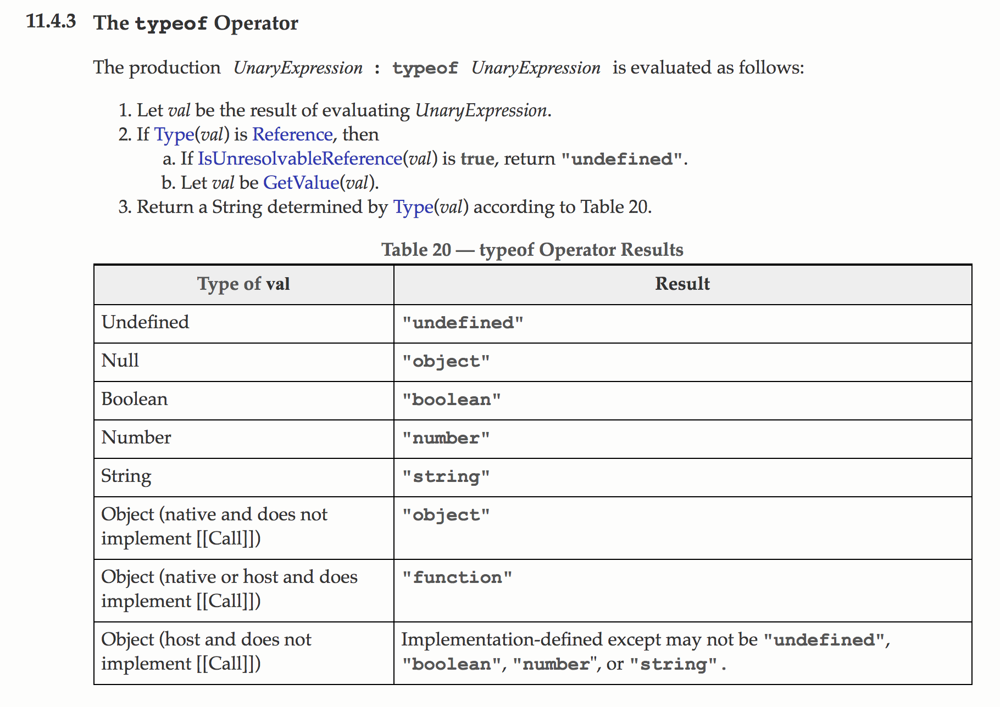

### 개요 

회사에서 새롭게 프론트엔드 스터디를 하게 되면서 다시 한번 `인사이드 자바스크립트`를 읽게 되었다. 이 책에서 처음으로 접하게 되는 내용이 바로 자바스크립트의 타입(type)에 관한 내용이다. 해당 내용에 대해서 잘 정리된 자료들이 많지만 다시 한번 스스로 정리해보고 싶다는 생각이 들어서 이 포스팅을 작성하게 되었다.

### 종류

ES6 기준 자바스크립트에서 프리미티브 타입은 총 6가지가 있다. 그리고 프리미티브 타입이 아닌 `object` 타입이 존재한다.

- `Number`
- `String`
- `Null`
- `Undefined`
- `Boolean`
- `Symbol` // ES6에서 추가되었다.

### 특징

모든 프리미티브 값은 불변값(immutable)이다. 또한 `object` 타입과 다르게 함수의 매개변수로 사용될때 `pass-by-value` 형식으로 전달된다. `typeof` 연산자를 사용해서 특정 값이 어떤 타입인지를 알아낼 수 있다.

### Number

Number 타입은 숫자를 나타내는 자료형이다. 하지만 다른 언어를 사용하다가 처음 자바스크립트를 사용하는 개발자라면 몇가지 주의해야할 점이 있다. 일단 자바스크립트에서는 `Number` 타입으로 정수와 실수를 모두 표현한다. ECMAScript에 표준을 따르면 `IEEE 754` 표준을 사용해서 부동소숫점을 표현하게 된다. 또한 자바스크립에서는 `-2^53`과 `2^53`사이의 정수만 안전하게 표현가능하다. 따라서 큰 수를 연산할때는 각별한 주의가 필요하다.

```
Math.pow(2, 60)
> 1152921504606847000
Math.pow(2, 60) + 1
> 1152921504606847000
```

ES6에서 새롭게 추가된 `Number.MAX_SAFE_INTEGER()`와 `Number.MIN_SAFE_INTEGER()` 함수를 사용하면 해당 값이 안전한 정수인지 아닌지 판단할 수 있다.

```
let safe = Number.MAX_SAFE_INTEGER;
let unsafe = safe + 1;
Number.isSafeInteger(safe);
> true
Number.isSafeInteger(unsafe);
> false
```

ES6에서는 `Number.isInteger()`라는 함수를 사용해서 해당 값이 정수인지 실수인지 판단하는 함수를 제공한다.

```
Number.isInteger(10);
> true
Number.isInteger(10.0);
> true
```

### String

문자열을 표현할때 사용되는 타입이다. C/C++과 다르게 문자열 역시 프리미티브 타입이기 때문에 불변값으로 처리된다. 즉 한번 할당된 문자열 값은 바뀌지 않는다. 또한 쌍따옴표나 홀따옴표를 사용해서 값을 할당한다.

```
let a = "hello world"
a[0] = 'o';
a
> "wjeoewjoiej"
```

ES6 이전까지는 문자열을 조합할때 `+` 연산자를 사용하거나 `String.prototpye.concat()` 메서드를 사용했지만 ES6부터는 template string이라는 기능을 제공해서 편하게 문자열을 조합해서 수 있게 되었다.

```
let js = 'javascript';
let str = `hello ${js}`;
str
> "hello javascript"
```


### booelan

`true` 혹은 `false` 두가지 값을 가질 수 있는 타입이다. `''`을 변환하게 되면 `false`인 것에 주의하자. 빈 오브젝트와 배열은 `true`를 반환한다.

```
new Boolean({})
> Boolean {true}
new Boolean([])
> Boolean {true}
new Boolean('')
> Boolean {false}
new Boolean(0)
> Boolean {false}
new Boolean(1)
> Boolean {true}
```

### null, undefined

값이 비어 있음을 나타낼때 사용되는 타입이다. undefined의 경우 다음 4가지의 경우에 나타난다.

- 값을 할당하지 않을 경우 그 변수는 `undefined` 값을 가지게 된다.
- 함수가 명시적으로 반환값을 명시하지 않으면 `undefined`가 반환된다.
- 함수의 매개변수를 전달하지 않았을때 해당 매개변수의 값은 `undefined`를 가지게 된다.
- object의 존재하지 않은 프로퍼티의 접근할 경우 `undefined` 값을 반환한다.

일반적으로 개발자가 명시적으로 이 값이 비어있음을 나타내고 싶을때는 `null` 값을 할당한다. 한가지 주의할 점은 `undefined` 값은 `typoof` 연산자를 사용할때 `undefined`을 리턴하지만. `null` 값은 `typeof` 연산자를 사용하면 `object`를 리턴한다. 혼란스럽지만 스펙에 아래와 같이 정확히 정의되어 있다.




### Object wrapper

여기까지 글을 읽다보면 한가지 의문점이 들 수 있다. `string` 프리미티브 타입들은 속성을 사용할 수 없다고 했지만, 자바스크립트에서 `str.length`와 같은 코드는 흔하게 찾아볼 수 있다. 해당 코드는 어떻게 동작하는 것일까?

MDN에서는 다음과 같이 설명하고 있다.

> String literals (denoted by double or single quotes) and strings returned from String calls in a non-constructor context (i.e., without using the new keyword) are primitive strings. JavaScript automatically converts primitives to String objects, so that it's possible to use String object methods for primitive strings. **In contexts where a method is to be invoked on a primitive string or a property lookup occurs, JavaScript will automatically wrap the string primitive and call the method or perform the property lookup.**

특정 속성이나 메소드가 실행될때, 자바스크립트 엔진이 자동적으로 프리미티브 값을 오브젝트로 변환해서 해당 함수를 실행할 수 있게 한다고 되어 있다. 주의해야 할 점은 `new String()`으로 만들어지는 객체는 프리미티브 값이 아니라 객체이다. 당연하겠지만 `typeof` 연산을 해보면 `object`를 리턴한다. 또한 프리미티브 값에 속성을 강제로 지정할 수도 있지만 해당 값은 제대로 동작하지 않는다.

```
const str1 = 'hello';
const str2 = new String('hello');

typeof str1
> 'string';

typeof str2
> 'object';

str1 == str2
> true

str1.test = 'world';
str1 + str1.test
> "helloundefined"
```

`str.length`가 어떻게 동작하는지 알아보기 위해서 [스펙](http://www.ecma-international.org/ecma-262/6.0/index.html#sec-getv)을 잠깐 뒤져보았다. 프리미티 값의 속성을 조회하는 연산은`GetV(V, P)`라는 추상 연산을 통해서 동작한다. 여기서 V는 프리미티브 값이고 P는 조회하려는 속성의 이름이다. 만약 V가 오브젝트가 아니라면, 해당 속성값을 조회하기 전에 wrapper object로 변환시켜서 연산을 수행한다고 명시되어 있다. 추상화된 연산은 아래와 같은 순서로 동작한다.

```
Assert: IsPropertyKey(P) is true.
Let O be ToObject(V).
ReturnIfAbrupt(O).
Return O.[[Get]](P, V).
```

### 정리

가벼운 마음으로 시작한 글이지만 하나씩 톧아보다 보니 제대로 알고 있는 내용이 별로 없었다. 앞으로도 이렇게 기본적인 내용을 조금씩 정리해두는 포스트를 작성하면서 스펙 문서와도 조금씩 친해지길 기도해본다. 또한 다 알고 있다고 생각하는 내용이라도 한번씩 다시 정리해는 습관을 가져야겠다라고 반성을 하는 시간이었다.